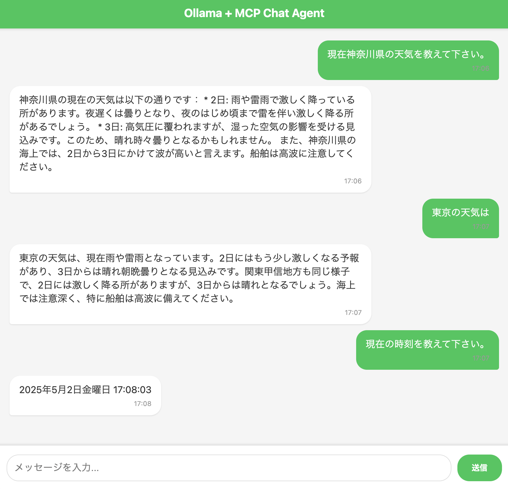

# OllamaとMCPを活用したLINE風チャットエージェント

## デモ動画

https://github.com/user-attachments/assets/5cd3ed31-8dc8-459c-89ba-aa5b35be1176

OllamaとModel Context Protocol(MCP)を活用したLINE風のチャットインターフェースを実装したWebアプリケーションです。

## 特徴

- LINE風のモダンなUIデザイン
- ローカルで動作するOllamaを利用したAIチャット機能
- MCPによる外部機能（天気情報、時刻情報など）の柔軟な統合
- リアルタイムなストリーミングレスポンス
- 完全にブラウザベースで動作

## スクリーンショット

## 必要要件

- Node.js 18.0以上
- Ollama
- MCP対応サーバー

## インストール方法

1. ローカル環境でOllamaを起動しておく
2. `git clone https://github.com/softjapan/ollama-mcp-agent.git`
3. `cd ollama-mcp-agent`
4. `npm run build`
5. `npm run start`
6. ブラウザで `http://localhost` にアクセス

## 技術スタック

### フロントエンド
- HTML/CSS/JavaScript
- Express.js (静的ファイル配信)

### バックエンド
- Node.js
- Express.js
- OpenAI API
- Model Context Protocol (MCP)
- TypeScript

### AI/ML
- Ollama (ローカルLLMサーバー)

### その他
- ESLint
- Prettier

## ライセンス

このプロジェクトはMITライセンスの下で公開されています。詳細は[LICENSE](LICENSE)ファイルをご覧ください。
